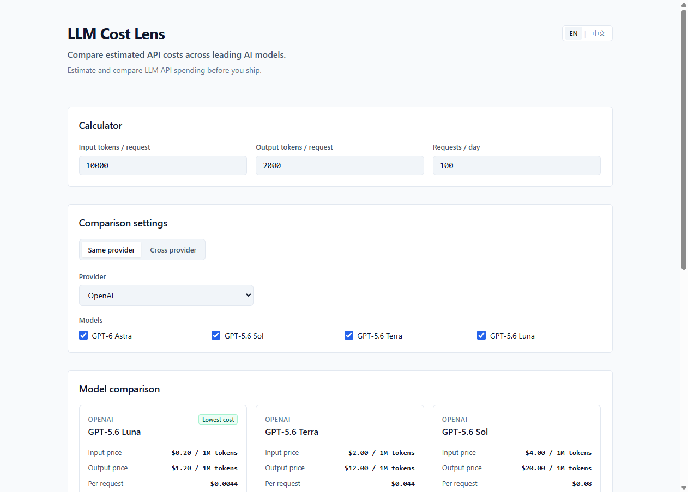

# LLM Cost Lens

English | [简体中文](README.zh-CN.md)

A lightweight browser-based calculator for comparing estimated LLM API costs across major AI providers.

---

## Live Demo

[Open LLM Cost Lens](https://llm-cost-lens.netlify.app/)

---

## Screenshot



---

## Features

- Real-time API cost estimation
- Same-provider model comparison
- Cross-provider multi-model comparison
- Multi-select model filtering
- Automatic lowest-cost highlighting
- Dynamic 30-day cost ranking
- English / Chinese interface
- Responsive desktop and mobile layout
- Official pricing source links
- Long-context pricing support for models with threshold-based rates
- Safe handling of invalid or extremely large numeric inputs

---

## Comparison Modes

- **Same provider**: Select a single provider from the dropdown, then select any combination of models under that provider to compare costs side-by-side.
- **Cross provider**: Select multiple models across different providers simultaneously for unified comparison. Cross provider mode does not limit you to one model per provider鈥攜ou can select any number of models from any provider.

---

## Supported Providers & Models

Tracks **22 models** across **4 providers**:

- **OpenAI (4)**: GPT-6 Astra, GPT-5.6 Sol, GPT-5.6 Terra, GPT-5.6 Luna
- **Anthropic (4)**: Claude Fable 5.1, Claude Opus 5, Claude Sonnet 5, Claude Haiku 4.5
- **Google (7)**: Gemini 3.8 Flash, Gemini 3.7 Flash, Gemini 3.6 Flash, Gemini 3.5 Flash, Gemini 3.5 Flash-Lite, Gemini 3.1 Flash-Lite, Gemini 3.1 Pro Preview
- **xAI (7)**: Grok 4.6, Grok Build 0.1, Grok 4.5, Grok 4.3, Grok 4.20 Multi-Agent, Grok 4.20 Reasoning, Grok 4.20 Non-Reasoning

---

## How Cost Is Calculated

Prices are denominated in USD per 1M tokens. Calculations are computed as follows:

- **Per-request cost**:
  $$\text{Cost} = \left(\frac{\text{Input Tokens}}{1{,}000{,}000} \times \text{Input Price}\right) + \left(\frac{\text{Output Tokens}}{1{,}000{,}000} \times \text{Output Price}\right)$$

- **Daily cost**:
  $$\text{Daily Cost} = \text{Per-request Cost} \times \text{Requests per Day}$$

- **30-day estimate**:
  $$\text{30-day Estimate} = \text{Daily Cost} \times 30$$

---

## Pricing Data

Pricing data is manually verified against official provider documentation.

- **Last checked**: 2026-09-04
- **Official sources**:
  - [OpenAI Pricing](https://developers.openai.com/api/docs/models/compare)
  - [Anthropic Pricing](https://platform.claude.com/docs/en/about-claude/pricing)
  - [Google Gemini Pricing](https://ai.google.dev/gemini-api/docs/pricing)
  - [xAI Pricing](https://docs.x.ai/developers/pricing)

*Note: Pricing is a snapshot and may change over time.*

---

## Long-context Pricing

For models in `MODEL_PRICING` that have threshold-based long-context pricing rules, the calculator automatically switches to the corresponding tiered rates based on the `Input tokens / request` value.

---

## Known Limitations

- Standard text token pricing only
- Cached input pricing is not included
- Batch API discounts are not included
- Tool calls and other API-specific charges are not included
- Actual token usage may differ by provider and model

*This calculator is intended for estimation rather than billing reconciliation.*

---

## Tech Stack

- HTML5
- CSS3
- Vanilla JavaScript
- Netlify (hosting)

The project uses no framework, no backend, and no npm dependencies. It intentionally uses a minimal static stack because the core problem is client-side calculation and comparison.

---

## Run Locally

Clone the repository and run a local static file server:

```bash
git clone https://github.com/aThreeleaf/llm-cost-lens.git
cd llm-cost-lens
python -m http.server 8000
```

Then visit: `http://localhost:8000`

Because the project is fully static, `index.html` can also be opened directly in a browser.

---

## AI-assisted Development

This project was built using an AI-assisted development workflow. AI tools supported implementation, review, and iteration, while product decisions, scope control, validation, and final acceptance remained human-driven:

- Product scope and iterative review: ChatGPT
- Primary implementation: Antigravity
- Independent code review and QA: Codex
- Final decisions, requirement changes, validation, and Git commits: human developer

[Read the full AI collaboration record](docs/ai-collaboration.md)

---

## Project Status

MVP complete.

Completed milestones:
- Core calculator
- Same-provider comparison
- Cross-provider multi-model comparison
- Responsive UI
- English / Chinese interface
- Public Netlify deployment
- Independent Codex QA
- Overflow fix and targeted re-review PASS
